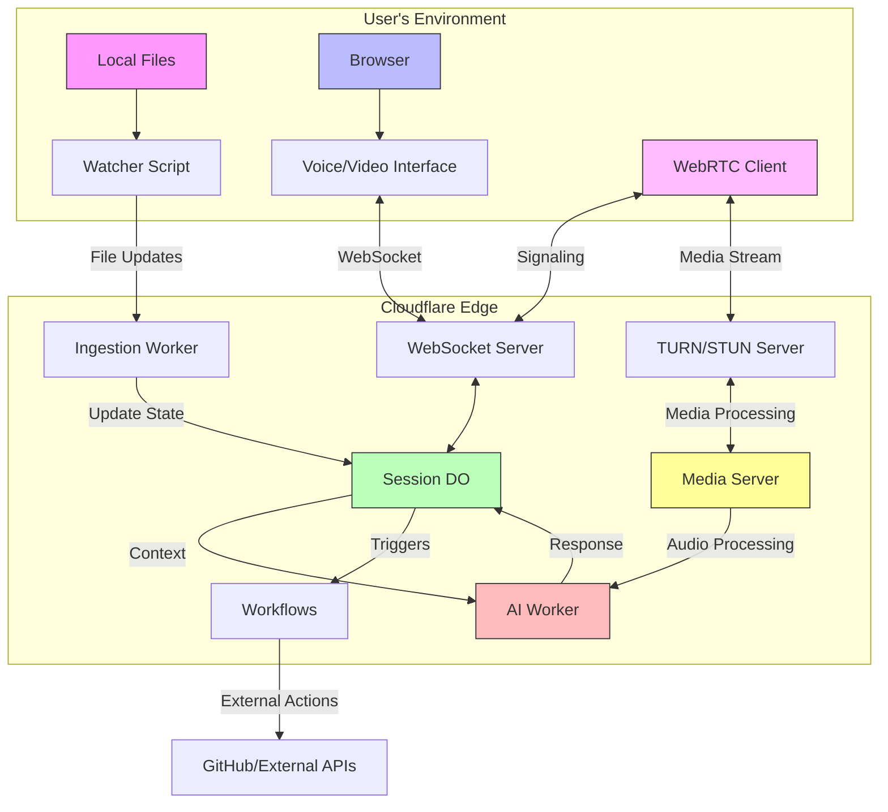

# Whisper: Voice-First AI Pair Programming

A next-generation developer tool that brings the power of voice-based AI pair programming to your local development environment. Whisper acts as an ambient AI co-pilot that you can have natural conversations with while coding.

## 🚀 Key Features

- **Voice-First Interface**: Natural conversations with AI through voice, just like talking to a senior engineer
- **Real-Time Context**: Full awareness of your local codebase through live file syncing
- **Proactive Assistance**: AI can perform tasks like creating GitHub issues from TODO comments
- **Seamless Integration**: Simple setup with a single `npx` command
- **Modern Stack**: Built entirely on serverless architecture using Cloudflare's edge computing platform

## 🏗 Architecture



The system consists of three main components:

1. **Local Client (The Eyes)**
   - Watches for file changes in your project
   - Syncs updates to the cloud in real-time
   - Minimal footprint Node.js script

2. **Web Frontend (The Voice)**
   - React-based web application
   - Handles voice recognition and synthesis
   - Real-time WebSocket communication

3. **Cloudflare Backend (The Brain)**
   - Session management with Durable Objects
   - AI processing with Workers
   - Real-time communication server
   - Workflow automation for tasks

## 💻 Tech Stack

- **Frontend**
  - React + Vite
  - Tailwind CSS
  - WebRTC for real-time communication
  - Web Speech API for voice synthesis
  - TypeScript

- **Backend**
  - Cloudflare Workers
  - Durable Objects
  - Cloudflare Workflows
  - Cloudflare Realtime

- **Local Tools**
  - Node.js
  - chokidar for file watching
  - npx for easy distribution

- **Development**
  - Turborepo
  - TypeScript
  - ESLint
  - Prettier

## 🚦 Getting Started

1. Clone the repository:

   ```bash
   git clone https://github.com/yourusername/whisper.git
   cd whisper
   ```

2. Install dependencies:

   ```bash
   pnpm install
   ```

3. Set up environment variables:

   ```bash
   # Create .env files in apps/web and apps/backend
   cp apps/web/.env.example apps/web/.env
   cp apps/backend/.env.example apps/backend/.env
   ```

4. Start the development environment:
   ```bash
   pnpm dev
   ```

## 📁 Project Structure

```
whisper/
├── apps/
│   ├── backend/     # Cloudflare Workers backend
│   ├── docs/        # Documentation site
│   ├── watcher/     # Local file sync client
│   └── web/         # Main web application
├── packages/
│   ├── eslint-config/   # Shared ESLint configurations
│   ├── shared/          # Shared TypeScript types
│   ├── typescript-config/  # Shared TS configs
│   └── ui/              # Shared UI components
```

## 🛠 Development

This is a Turborepo project. Here are some common commands:

```bash
# Run development server
pnpm dev

# Build all packages and apps
pnpm build

# Run linting
pnpm lint

# Run type checking
pnpm typecheck
```

## 📄 License

MIT License - see the [LICENSE](LICENSE) file for details.
